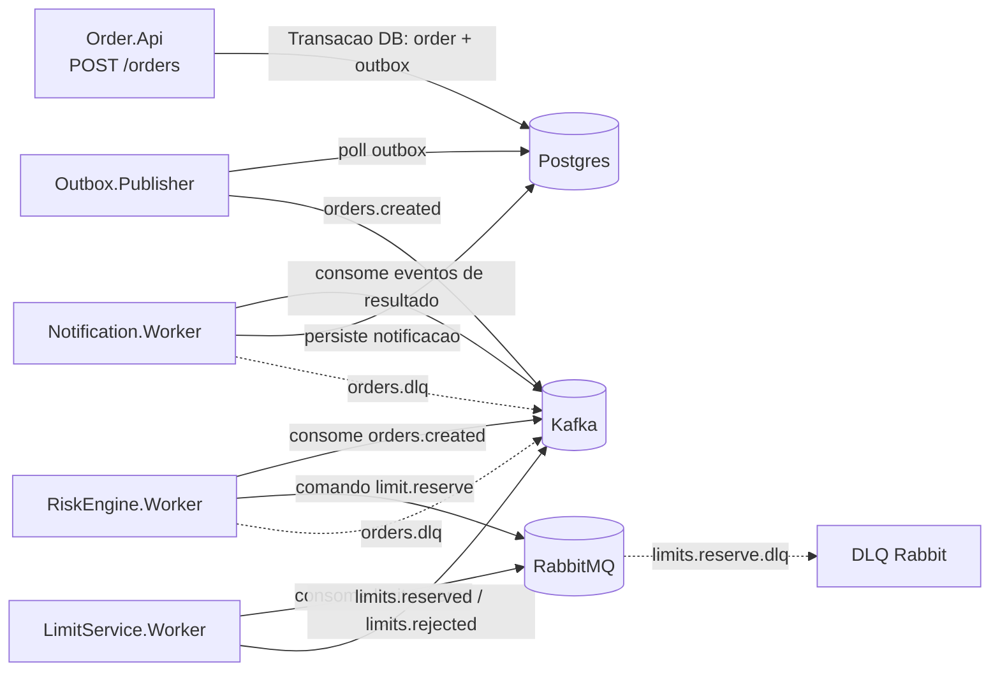

# event-driven-finance-lab-dotnet

Lab publico que demonstra arquitetura orientada a eventos em .NET usando Kafka (eventos de dominio) e RabbitMQ (fila de comandos), com padroes de producao: outbox, consumidores idempotentes, retry/backoff, DLQ e tracing de ponta a ponta.

## Objetivos
- Demonstrar o fluxo `Order -> Risk -> Limit -> Notification` em um dominio financeiro.
- Mostrar Kafka e RabbitMQ em seus papeis mais adequados.
- Fornecer setup local reproduzivel com `docker compose up -d`.
- Entregar cenarios prontos para entrevista (happy path, duplicidade, DLQ, replay).

## Stack Tecnica
- .NET 8
- PostgreSQL + Dapper
- Kafka (KRaft) via `Confluent.Kafka`
- RabbitMQ via `RabbitMQ.Client`
- OpenTelemetry + Jaeger + Prometheus
- Logs estruturados com Serilog

## Arquitetura


## Estrutura do Repositorio
```
/src
  /Order.Api
  /Outbox.Publisher
  /RiskEngine.Worker
  /LimitService.Worker
  /Notification.Worker
  /BuildingBlocks
/contracts
/docs
/infra
/scripts
```

## Quickstart
### Pre-requisitos
- Docker + Docker Compose

### Subir todos os servicos
```bash
docker compose -f infra/docker-compose.yml up -d --build
```

### Verificar health
```bash
curl http://localhost:8080/health
curl http://localhost:8081/health
curl http://localhost:8082/health
curl http://localhost:8083/health
curl http://localhost:8084/health
```

### Abrir observabilidade
- Jaeger: http://localhost:16686
- Prometheus: http://localhost:9090
- Lab UI E2E: http://localhost:8080/lab

## Lab UI (E2E)
A UI em `Order.Api` mostra o fluxo completo da mensageria com polling de 1s:
- Timeline por ordem com etapas de API, Kafka, RabbitMQ e workers.
- Pipeline visual do caminho `Order.Api -> Outbox -> Kafka -> Risk -> Rabbit -> Limit -> Kafka -> Notification`.
- Painel DLQ com contadores e ultimas falhas.
- Acao de replay para Rabbit DLQ e Kafka DLQ.
- Botoes `Rodar 1x`, `Rodar 10x` e `Rodar Falhas` para iniciar demos sem terminal.

### Endpoints da UI
- `GET /lab`
- `POST /lab/api/smoke/run`
- `GET /lab/api/orders/recent?limit=20`
- `GET /lab/api/orders/{orderId}/timeline`
- `GET /lab/api/dlq/overview`
- `POST /lab/api/dlq/replay/rabbit?count=50`
- `POST /lab/api/dlq/replay/kafka?count=50`

## API
### Criar ordem
```bash
curl -X POST http://localhost:8080/orders \
  -H 'Content-Type: application/json' \
  -H "x-correlation-id: $(uuidgen)" \
  -d '{
    "accountId": "11111111-1111-1111-1111-111111111111",
    "symbol": "PETR4",
    "side": "BUY",
    "quantity": 100,
    "price": 32.15
  }'
```

### Consultar status da ordem
```bash
curl http://localhost:8080/orders/{orderId}
```

## Cenarios
### A) Happy path
```bash
./scripts/smoke.sh
```
Tambem e possivel usar os botoes da UI em `http://localhost:8080/lab`.

### B) Duplicidade e idempotencia
- Reinicie um consumer enquanto ha mensagens em processamento:
```bash
docker restart risk-engine
```
- Procure no log por `duplicate ignored`.

### C) Forcar DLQ no Rabbit
- Envie uma ordem com simbolo `DLQ1` para forcar falha no `LimitService.Worker`.
- Confirme a mensagem na DLQ `limits.reserve.dlq`.

### D) Replay de DLQ
```bash
./scripts/replay-rabbit-dlq.sh
./scripts/replay-kafka-dlq.sh
```

## Headers Obrigatorios de Mensagem
- `message_id`
- `correlation_id`
- `order_id`
- `causation_id` (opcional)
- `event_type`
- `event_version`
- `occurred_at`

## Decisoes Tecnicas
- Kafka carrega eventos imutaveis de dominio e fan-out.
- RabbitMQ trata semantica de comandos/work-queue.
- Outbox evita inconsistencias de dual-write entre API e broker.
- Idempotencia usa chave unica em `integration.processed_messages`.

## Metricas
Todos os servicos expoe:
- `/health`
- `/metrics`

Contadores principais:
- `processed_count`
- `failed_count`
- `dlq_count`

## Troubleshooting
- Se servicos falharem no startup, veja logs:
```bash
docker compose -f infra/docker-compose.yml logs -f --tail=200
```
- Verificar conectividade Kafka:
```bash
docker exec kafka kafka-topics --bootstrap-server localhost:9092 --list
```
- Verificar filas Rabbit:
```bash
docker exec rabbitmq rabbitmqctl list_queues
```

## CI
O pipeline do GitHub Actions executa:
- build
- testes unitarios/integracao
- checagem de formato (`dotnet format --verify-no-changes`)
- smoke test com Docker Compose

## Documentacao em Portugues
- `docs/architecture.md`
- `docs/scenarios.md`
- `docs/pt-BR/architecture.md`
- `docs/pt-BR/scenarios.md`
